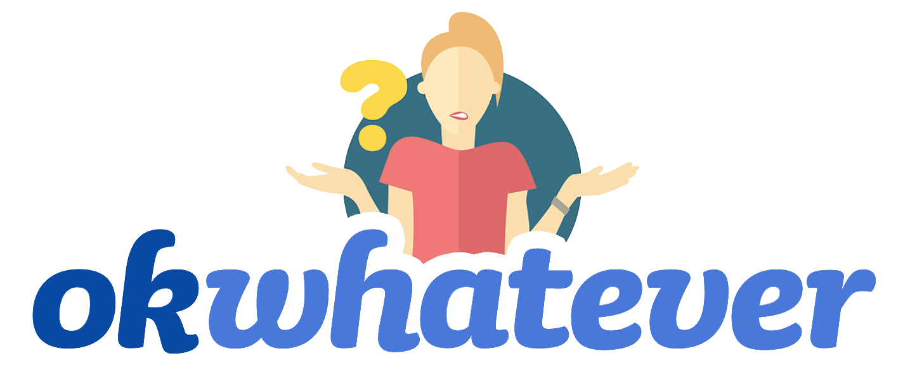

# okwhatever

A dating app for people who have almost given up.

## Built With
[Bootstrap 3](http://getbootstrap.com/docs/3.3/) - 
[Socket]
[Masonry]
[Mocha & Chai](http://mherman.org/blog/2015/09/10/testing-node-js-with-mocha-and-chai/#.Wr7PjZPwbOQ) - Framework for testing JavaScript functions.
[Handlebars]
[Sequelize]

## Authors
[Jennifer Valle](https://github.com/jvallexm) (http://jennifer-valle.com)
[Peter Johnstone](https://github.com/p2bilt) (http://p2bilt.com)
[Emanuel Siu](https://github.com/emansiu)
[Amy Lumpkin](https://github.com/amylumpkin)

